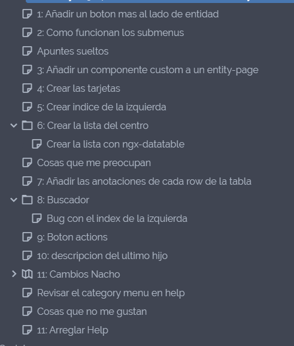

# Como es mi forma de trabajar

Como ya he explicado en inicio lo que mas me gusta es escribir todo, desde cosas nuevas hasta lo que hago diariamente.

Lo que a mi me gusta es analizar la tarea, romperla en minitareas y documentar el proceso poco a poco.
Esto esta muy bien ya que luego si tengo que hacer una tarea parecida, revisando los apuntes puedo hacer la nueva tarea de forma similar y por lo tanto toda la aplicacion sera homogenea.

En este ejemplo tenia que hacer una ruta con estas caracteristicas.

