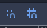

# Godot docs

## Tutorial para principiante

Crear un rpg simple

https://godottutorials.pro/rpg-godot-tutorial/

## Websockets ejemplo

https://github.com/gd-com/examples

## Godot mobile

https://docs.godotengine.org/en/3.0/getting_started/step_by_step/your_first_game.html

## Udemy

### Proyecto 1

#### Capitulo 4

* Los nodos tiene que tener esta estructura --> HelloWorld 

  > Primera letra en mayuscula
  >
  > Sin espacios
  >
  > Cada palabra con la primera letra en mayus

* Crear un nuevo script

  

* Los comentarios en godot se hacen asi.

  > `# Codigo comentado`

* `_ready()` Es la funcion que se ejecuta cuando el nodo se ejecuta en el juego.

* Documentacion de cada metodo/funcion.

  Cuando se quiere sacar por consola algo y se escribe `print()` si se pincha `ctr + click` nos ejecutara la documentacion de godot.

* Variables

  Definir variables `var variable = "Hello"`

  Concatenar variable `variable + "World"`

  Comparar variables `variable == "Hello"`

* Transformar algo en string `str(number)`

#### Capitulo 5

* Links utiles:

  [Community gamedev](https://community.gamedev.tv/)

#### Capitulo 12

Proyecto que se llama ***Loony Lips***

Recorrer un array y usarlo en medio de un string.

```py
var prompts = ["nombre", "Jesus", "Berisa"]
var story = "Mi %s es %s y mi apellido es %s"
print (story % prompts)

Resultado --> Mi nombre es Jesus y mi apellido es Berisa
```

Si hay mas argumentos que espacios libres en el string, al compilar dará error.

```pyth
var prompts = ["nombre", "Jesus", "Berisa", "pepe"]
var story = "Mi %s es %s y mi apellido es %s"
print (story % prompts)
```


Y lo mismo pasa al contrario, hay definidos mas `%s` de los que hay en el array.

#### Capitulo 13

Seguimos con ***Loony Lips***.

* La forma para añadir un background.

  Se pincha en **Add child node.**

  

  Buscamos en el buscador **text** y seleccionamos el **TextureRect**.


En la parte de la derecha


Seleccionamos **texture** y despues **load**, y seleccionamos de assets el background.

* `get_node('node')` Con esta funcion obtenemos el nod

  Ejemplo: Tengo un nodo que se llama **Label**.

  Pues con `get_node("Label")` estoy obteniendo el nodo **Label** y puedo acceder a sus propiedades, cambiar texto, tamaño etc...

  > Si haces drag (seleccionando el nodo) y drop dentro de get_node() tambien vale

  Forma 2 (Que yo creo que mejor)

  `$Label`

* Para organizar cosas dentro de la pantalla se usan los `HBoxContainer `y el `VBoxContainer`

* Que eventos tienen los nodos?

  

  En la imagen se puede ver que si selecciono el `LineEdit` y en la barra de la derecha selecciono `Node` me aparecen un listado de metodos que tiene el `LineEdit`

#### Capitulo 15

* La forma de organizar los objetos dentro del juego son a traves de `VBoxContainer` y de `HBoxContainer`

#### Capitulo 16

* Definir la variable como `onready`

  Esto significa que cuando godot ejectue el codigo asignara a una variable algo que aun no existe, y como no existe no dara error.

  Ejemplo:

  ​	Tenemos (por orden) estos objetos:

  ​		-Boton

  ​		-Label

  ​	Si ahora definimos en el codigo fuera de `_ready()` la variable `titulo_boton` sin poner el onready dara error

  ​	`var titulo_boton = $LabelTituloBoton` --> Error porque el label aun no existe

  ​	`onready var titulo_boton = $LabelTituloBoton` --> Ok porque estas asignando el label a una variable pero sin verificar si existe

#### Capitulo 17

* `queue_free()` Libera el objeto (por ejemplo un label ) de memoria

* `get_tree()` Obtengo todo el arbol, como `get_node()` pero mejor ya que obtengo el nodo `root` tambien

  > En el video que estoy viendo usa `get_tree().reload_current_scene()` y lo que hara sera recargar el nodo entero

#### Capitulo 18

* Diccionario

  > `my_dictionary = {key:value, key:value}`

  A tener en cuenta:

  > ```py
  > var story = "hola"
  > var dictionary = {story:"adios"} 
  > ```
  >
  > Cuidado porque en el diccionario story esta cogiendo el valor definido en la variable, no esta poniendo como key la palabra story


* `randi()`  Baraja de cartas, coje la primera, le doy otra vez y coje la segunda
* `randomize()` Baraja las cartas, coje una, vuelve a barajar y coje otra

#### Capitulo 19

* Como tipificar variables

  `var prompts : PoolStringArray` De esta forma se queda definido como Array de Strings

* `get_child_count()` Para saber cuentos hijos tiene un nodo

* `get_child()` Para obtener el hijo del nodo en especifico

#### Capitulo 20

* Como leer un archivo json

  ```python
  func get_from_json(filename)
  	var file = File.new()
  	file.open(filename, File.READ)
  	var text = file.get_as_text()
  	var data = parse_json(text)
      file.close()
      return data
  ```

#### Capitulo 21

* Por ultimo para exportar el proyecto simplemente hay que darle al boton de exportar y au

### Proyecto 2 (Hoppy Days) (Proyecto 2D plataformas)

#### Capitulo 33

* Assets gratis ([link](https://www.kenney.nl/assets))

#### Capitulo 35

* `StaticBody2D` 
  * No esta diseñado para moverse
  * Esta hecho para hacer paredes, suelos, plataformas etc...
* `RigidBody2D`
  * Controlado por las fisicas 2D
  * Hecho para crear gravedad y friccion
* `KinematicBody2D`
  
* Pensado para ser controlado por jugadores
  
* `PhysicsBody2D` 
  * Todo lo que interactura con las fisicas
  * No le afecta las fisicas 2D
  * Se puede mover con un control

* Hacer un personaje
  * Crear un `KinematicBody2D`
    * `move_and_collide()` 
      * Cuando chocas con algo se para.
      * Puedes obtener informacion de con lo que te has chocado.
    * `move_and_slide()`
      * Cuando te chocas con algo 
  * Añadirle un `sprite` 
  * Añadirle un `CollisionShape2D`
    * Lo agrandas y metemos el personaje dentro del circulo

* Operadores

  * En godot se usan estos operadores:

    > and, or, not, !=
    >
    > (not y != es lo mismo)

#### Capitulo 37

* Como añadir animaciones al `KinematicBody2D`

  * Añadir al `KinematicBody2D` un `AnimatedSprite`

    

  * Despues seleccionamos el `AnimatedSprite` que acabamos de crear y le añadimos un nuevo frame

    

  * Despues añadimos los assets que necesite la animacion 

    

    > En este caso la imagen esta apuntando a la derecha, si queremos que cuando nos movamos la imagen haga flip hacia la izquierda hay que usar la propiedad `flip_h` de `AnimatedSprite`

#### Capitulo 38

* Emitir eventos y que se escuchen desde cualquier sitio

  `signal evento` --> Declaracion del evento

  `emit_signal(...)` --> Emito el evento


​	Al guardar ya vemos que gotod a detectado el evento que hemos definido antes


Le damos al boton conectar y lo conectamos con el AnimatedSprite


Aqui se ve como ya esta conectado


#### Capitulo 39

En este capitulo se va a crear un nivel de juego, con sus terrenos y sus interacciones entre jugador/terreno

* Crear una nueva escena

* Añadir los assets de terreno

  

  > Se arrastra de la carpeta de assets a dentro de godot

* Se le añade `StaticBody2D`  y `CollisionPolygon2D` a cada asset

  

* Despues hay que exportarlo en tileset

  

* Despues se tiene que guardar 

  

* PAra añadir el tileset al nivel en el que estoy

  

* Añadimos el TileMap que hemos guardado antes

  

* Una vez cargado el TileMap nos apareceran el listado de componentes que hemos guardado en el tilemap

  

* El del video hace algo relacionado con esto seleccionando el node de `Player` y no se para que es

  

  

  > Dice que es importante definir que cosas pueden interactuar con que, pero aun no entiendo el para que se usa
  >
  > Google:
  >
  > > > - collision_layer describes the layers that the object **appears in**. By default, all bodies are on layer 1.
  > > > - collision_mask describes what layers the body will **scan for collisions**. If an object isn’t in one of the mask layers, the body will ignore it. By default, all bodies scan layer 1.
  >
  > Definicio del video:
  >
  > > * Collision layers: Which layers we exist on
  > > * Collision Mask:  Which layers we can interac with
  >
  > Resumen mejor:
  >
  > ​	Si estas seleccionando un conejo en layer tienes que seleccionar el layer definido conejo
  >
  > ​	Si has seleccionado el conejo como ejemplo en mask tienes que seleccionar con lo que puede interactuar

* `is_on_ceiling()`

  Returns true if the body is on the ceiling

  Devuelve true si el cuerpo esta en el techo

  Por lo tanto sirve para detectar, por ejemplo, cuando saltas que te estas chocando con el techo

  ```python
  func jump():
  	if Input.is_action_pressed("jump") and is_on_floor():
  		motion.y -= JUMP_SPEED
  	elif is_on_ceiling():
  		motion.y = 1
  ```

  Cuando se ejecute el `is_on_ceiling()` lo que hago es resetear la altura del muñeco y lo muevo al suelo

#### Capitulo 41

* Parallax Guidelines

  Esta tecnica lo que produce es gracias a mover mas rapido/lento el fondo da la sensacion de que el jugador esta llendo mas rapido/lento dentro del juego.

  Dependiendo de como configures el background el jugador tendra una sensacion de velocidad distinta.

* Para añadir un background

  `TextureRect` Y despues para hacerlo responsive hay que hacer lo siguiente

  

#### Capitulo 42

* End-game

  Crear una nueva escena y cambiar entre escenas con `get_tree().change_scene("res://Levels/EndGame/EndGame.tscn")`

#### Capitulo 43

* Crear pinchos

  Esto es parecido a la manera de crear assets.

  Lo que se esta haciendo es crear un terreno, que cuando, por ejemplo el conejo se acerca, se ejecuta una funcion.

  1. Creamos un `Area2D` y dentro un `Sprite` y un `CollisionPolygon2D`

     

  2. Añadimos el asset al `Sprite`

  3. Le damos bordes al `Sprite` (desde el `CollisionPolygon2D`)

     

  4. Creamos una funcion que detecte cuando un body entra en contacto con este sprite

     

  5. Añadir un nuevo layer name

     

  6. Definimos que los pinchos son un layer pinchos (definimos que los pinchos son layer pinchos)

     

  7. Definimos con que pueden interactuar estos pinchos (definimos que los pinchos pueden interactuar con los layer Player(conejo))

     

  8. Se crea un `Node` (No confundir con `Node2D` ya que en este caso no hace falta saber la posicion del pincho)

     

  9. Añadimos los pinchos al nivel que queramos (Level1 en este caso) (Se hace instanciando)

     

  10. Resultado

      

      

  11. Controlar esto desde el script del conejo

      > Lo que hay que hacer es ejecutar el metodo `hurt()` que esta definido en el script del conejo desde el asset de pinchos, ya que es ahi donde se detecta que el conejo esta encima/tocando el asset pinchos

      

      

      

  

#### Capitulo 44

* Añadir sonido/musica

  Se añade al jugador el objeto `AudioStreamPlayer`.

  

  Despues se añade el audio al objeto.

  

#### Capitulo 45


### Hoppy Days 2.0

#### **Todo**

* [ ] Cuando el conejo se mueva de derecha a izqueirda actualizar la animacion

#### **Curiosidades**

##### has_method()

* Este if lo que hace comprobar que en el nodo que le has pasado tenga el metodo 'hurt'

  ```python
  if body.has_method("hurt"):
  	print("hola")
  ```

  > [bool](https://docs.godotengine.org/en/stable/classes/class_bool.html#class-bool) **has_method** **(** [String](https://docs.godotengine.org/en/stable/classes/class_string.html#class-string) method **)** const
  >
  > Returns `true` if the object contains the given `method`.

  [Link docs](https://docs.godotengine.org/en/stable/classes/class_object.html#class-object-method-has-method)

##### Posicion global del jugador

* #### Obtener la posicion del jugador

  ```python
  func mostrar_posicion():
  	var player_pos = get_node(".").get_transform().get_origin()
  	print("Posicion: " + String(player_pos))
  ```

  

#### **Crear un jugador**

* El jugador se crea con `KinematicBody2D`

  * El jugador necesita un `CollisionShape2D`

    > Editor facility for creating and editing collision shapes in 2D space
    >
    > Te crea un aurea que te cubre y sirve para las colisiones

  * El jugador tambien necesita `AnimatedSprite`

    > Sirve para añadir assets (añadirle la imagen de conejo) y para darle animacion
    >
    > Primero hay que crear el nuevo `SpriteFrame`
    >
    > 
    >
    > Pinchamos sobre el nuevo sprite para que nos salga la caja de abajo
    >
    > 
    >
    > 
    >
    > Y ahora lo que hay que hacer es ir creando animaciones y le añadimos las fuentes (le añadimos las imegenes del conejo)
    >
    > 
    >
    > Desde aqui las puedes ver todas y ejecutarlas
    >
    > 
    >
    > Ahora hay que añadir el `CollisionShape2D`
    >
    > 
    >
    > Y este es el resultado
    >
    > 
    >
    
  * Ahora hay que programar al conejo (añadirle movimiento, camara etc...)
  
    > Le añadimos el script al conejo
    >
    > La funcion de inicio es `func _physics_process(delta):` y es la primera en ejecutarse

##### Añadirle propiedades al jugador

* `move_and_slide(motion, UP)` Esto hay que ejecutarlo al principio.

  Esto lo que hace es: Moves the body along a vector

* Darle gravedad al jugador

  > ```python
  > func aplicar_gravedad():
  > 	# Funcion de godot
  > 	# Returns true if the body is on the floor. Only updates when calling move_and_slide().
  > 	if is_on_floor():
  > 		motion.y = 0
  > 	else:
  > 		motion.y += GRAVITY
  > ```

* Mover de derecha a izquierda el conejo

  > ```
  > # Movimiento del conejo
  > func movimiento():
  > 	if Input.is_action_pressed("izquierda") and not Input.is_action_pressed("derecha"):
  > 		motion.x = -1000
  > 	elif Input.is_action_pressed("derecha") and not Input.is_action_pressed("izquierda"):
  > 		motion.x = 1000
  > 	else:
  > 		motion.x = 0
  > ```
  >
  > "izquierda" y "derecha" son funciones que hay que definir primeramente en esta pantalla (project --> project settings)
  >
  > 
  
* Saltar

  > ```python
  > # Saltar
  > func saltar():
  > 	# Hay que hacer el if con el is_on_floor porque si no, nunca entra en el elif
  > 	if Input.is_action_pressed("saltar") and is_on_floor():
  > 		motion.y -= 3000
  > 	# Is_on_ceiling detecta si te estas chocando contra el techo
  > 	elif is_on_ceiling():
  > 		motion.y = 0
  > ```
  >
  > Esto hay que incializarlo en el `_physics_process` ya que godot lo tiene que tener en cuenta desde el incio del juego

##### Añadirle una camara al jugador

* La propiedad que hay que añadirle es `Camera2D` y se le añade en el nodo del jugador (ya que la camara es dependiente del jugador)

  >  En `Zoom` podemos cambiarle el tamaño a la camara
  >
  > 

  > Otra caracteristica es el `Drag Margin H E / V E` si esto esta desactivado, la camara se movera siempre que el muñeco se mueva.
  >
  > Al contrario, si esta activado solo se movera cuando el muñeco este a punto de salirse de la visual del jugador.

#### **Crear niveles**

* Para crear los niveles primero hay que crear los assets

  1. Se crea un `Node2D`

  2. Se añaden los assets arrastrandolos normal

     

  3. Ahora lo que hay que hacer es añadirles las propiedades `StaticBody2D`  y `CollisionPolygon2D` para que sean duros

     > Aqui ya se puede ver como este suelo al añadirle `StaticBody2D`  y `CollisionPolygon2D ` godot lo detecta como algo solido

     

     > Algo interesante es activar estas propiedades
     >
     > ​	Esto sirve para lockear el `StaticBody2D` y  el `CollisionPolygon2D` con el asset
     >
     > 
     >
     > ​	Esto sirve para meter de fondo un grid y poder hacer los bordes del asset con la ayuda del grid
     >
     > 

##### Crear pinchos

* Esto tiene relacion con los assets ya que lo que vamos a ahcer es crear un asset, pero que reacciona cuando un `KinematicBody2D` entra en contacto con este asset


#### **Pantalla de Game Over**

1. Creamos una nueva `User Interface`

   

2. Le añadimos un fondo y un boton  (`TextureRect` y `Button`)

   

   > Cuando añadimos el fondo, hay que pinchar en `Layout` --> `Full rect` para que nos ocupe todo.
   >
   > Y el `Expand` tambien para que si hacemos mas grande la pantalla se haga mas grande el fondo

3. Creamos un evento para cuando se pulse el boton

   

4. Cuando pinchemos en el boton ejecutamos `get_tree().change_scene("res://Levels/Level1.tscn")` para ir al nivel 1

   > ```python
   > func _on_Button_pressed():
   > 	get_tree().change_scene("res://Levels/Level1.tscn")
   > ```


#### **Hacer que los pinchos hagan daño al conejo cuando los toca**

Lo que vamos a hacer aqui es usar los pinchos que se han creado antes, y programar que cuando el conejo los toque, pierda 1 vida y salte.

1. Creamos un `Area2D` y dentro un `Sprite` y un `CollisionPolygon2D`

   

2. Añadimos el asset al `Sprite`

3. Le damos bordes al `Sprite` (desde el `CollisionPolygon2D`)

   

4. Creamos una funcion que detecte cuando un body entra en contacto con este sprite

   

5. Añadir un nuevo layer name

   

6. Definimos que los pinchos son un layer pinchos (definimos que los pinchos son layer pinchos)

   

7. Definimos con que pueden interactuar estos pinchos (definimos que los pinchos pueden interactuar con los layer Player(conejo))

   

8. Se crea un `Node` (No confundir con `Node2D` ya que en este caso no hace falta saber la posicion del pincho)

   

9. Añadimos los pinchos al nivel que queramos (Level1 en este caso) (Se hace instanciando)

   

10. Resultado

    

    

11. Controlar esto desde el script del conejo

    > Lo que hay que hacer es ejecutar el metodo `hurt()` que esta definido en el script del conejo desde el asset de pinchos, ya que es ahi donde se detecta que el conejo esta encima/tocando el asset pinchos

    

    

12. Añadimos el codigo necesario para que cuando el conejo toque los pinchos salte

    ```python
    func hurt():
    	# Espero a que el idle_frame emita un evento (de que se ha actualizado el frame) y cuando esto pasa
    	# es como si se reseteara esta funcion 
    	yield(get_tree(), "idle_frame")
    	motion.y -= 3000
    ```

    > Docs oficial sobre yield() [link](https://docs.godotengine.org/en/stable/getting_started/scripting/c_sharp/c_sharp_differences.html#yield)
    >
    > Google con un mejor resumen [link](https://godotengine.org/qa/38160/para-qu%C3%A9-se-usa-la-funci%C3%B3n-yield-function-explanation-yield)

    > ```verilog
    > # Reanudar la ejecución del siguiente cuadro.
    > yield(get_tree(), "idle_frame")
    > ```
    >
    > Idle_frame es un evento que se ejecuta cada 60s, si esta configurado el juego a 60 frames o 30s si el juego esta configurado a 30 frames (creo)

#### **Añadir sonidos**

Para añadir sonidos hay distintas formas.

Ejemplo 1:

* Añades un `AudioStreamPlayer2D` generico y vas importanto sonidos dependiendo del momento.

Ejemplo 2 (el que yo voy a  usar):

* Creas un `AudioStreamPlayer2D` por cada sonido que quieras añadir

  

Voy a usar esta segunda opcion ya que si lo importo todo de 1, se exactamente que sonidos tengo y en que objeto estan guardados.

1. Crear `AudioStreamPlayer2D`

2. Arrastrar el sonido hasta stream

   

3. **OJO CON ESTO**

   Cuando tu importas un sonido, por defecto viene en forma de loop, por lo tanto se ejecutara infinitamente.

   Para cambiar esta configuracion hay que irse a imports con el sonido seleccionado

   

   **Y DESELECCIONAR LA OPCION DE LOOP**

   Con esto lo que haces es que el sonido solo se ejecute 1 vez y si quieres hacer un loop de sonido pues lo programas.

4. Yo en este caso lo que he hecho a sido crear un enumerado y un switch para ejecutar los sonidos

   ```python
   # Enumerado donde defino todos los tipos de sonido que hay
   enum ACCIONES_MUSICA {
   	SALTAR,
   	DANYO
   }
   
   # Funcion que activa los sonidos dependiendo de la accion que le toque
   func activar_sonido_actiones(acciones):
   	match acciones:
   		ACCIONES_MUSICA.SALTAR:
   			$JumpMusic.play()
   		ACCIONES_MUSICA.DANYO:
   			$DamageMusic.play()
   ```

   Entonces cuando el muñeco salta, se ejecutara esta funcion que iniciara el objeto musica

   ```python
   # Saltar
   func saltar():
   	# Hay que hacer el if con el is_on_floor porque si no, nunca entra en el elif
   	if Input.is_action_pressed("saltar") and is_on_floor():
   		motion.y -= 3000
   		# Aqui esta la accion de activar el sonido
   		activar_sonido_actiones(ACCIONES_MUSICA.SALTAR)
   	# Is_on_ceiling detecta si te estas chocando contra el techo
   	elif is_on_ceiling():
   		motion.y = 0
   ```

   Y por otro lado esto ejecutando desde el principio la musica de background

   ```
   func _physics_process(delta):
   ...
   	# Inicio la musica de fondo
   	iniciar_background_music()
   
   func iniciar_background_music():
   	# Si la musica de fondo esta sonando pues no la vuelvo a iniciar, porque se crea un bucle infinito
   	if not $BackgroundMusic.playing:
   		$BackgroundMusic.stream = load("res://assets/SFX/Chiptune_Adventures_1.ogg")
   		$BackgroundMusic.play()
   ```

   