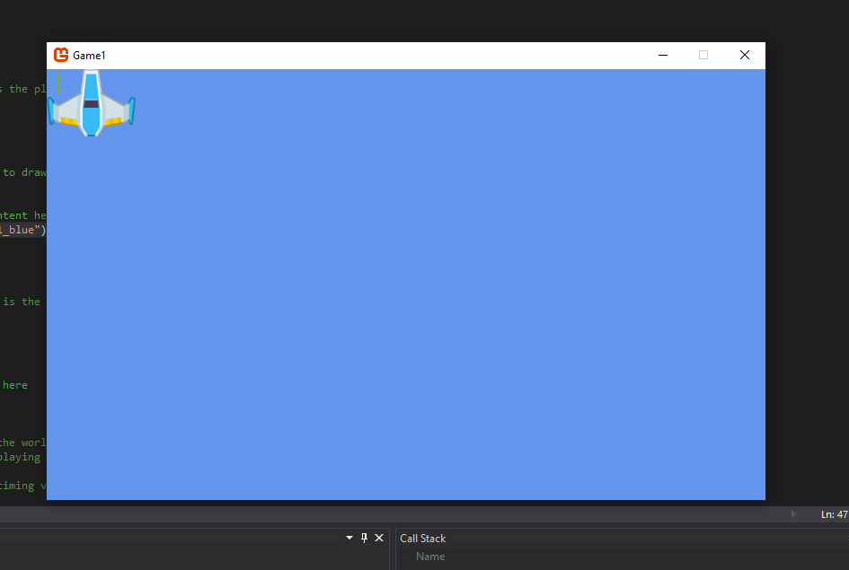

[Youtube](https://www.youtube.com/watch?v=r5dM0_J7KuY&list=PLV27bZtgVIJqoeHrQq6Mt_S1-Fvq_zzGZ)

### Como crear sprites

El sprite al fin y al cabo es un objeto que tiene una textura y una posicion

            private Texture2D _texture;
            private Vector2 _position;

---

Para crear el sprite necesitamos primero añadirlo al Content.

Con el programa MonoGame Pipeline Tool añadimos el sprite (en mi caso la nave azul playerShip1_blue.png), lo guardamos y lo compilamos.

Para acceder desde el codigo a este asset hay que hacerlo de la siguiente manera.

    _texture = Content.Load<Texture2D>("playerShip1_blue");

> Fijarse que el nombre no tiene la terminacion png

---

El sprite necesita necesita tambien la posicion y eso se hace con el Vector2

    _position = new Vector2(0, 0);

---

Ahora que ya tenemos la textura y la posicion solo queda pintar el sprite.

Para pintarlo hay que hacerlo en el metodo `Draw()` que es el metodo que se encarga de pintar cosas

            protected override void Draw(GameTime gameTime)
            {
                GraphicsDevice.Clear(Color.CornflowerBlue);

                spriteBatch.Begin();
                spriteBatch.Draw(_texture, _position, Color.White);
                spriteBatch.End();
                // TODO: Add your drawing code here

                base.Draw(gameTime);
            }

Hay que hacer un `Begin(), Draw(), End()` no se porque pero hay que hacerlo asi.

Resultado:

> Para que el sprite este centrado en el centro de la pantalla
>
> `spriteBatch.Draw(_texture, _position,null, Color.White, 0f,new Vector2(_texture.Width / 2, _texture.Height / 2), 1f, SpriteEffects.None, 1f);`
