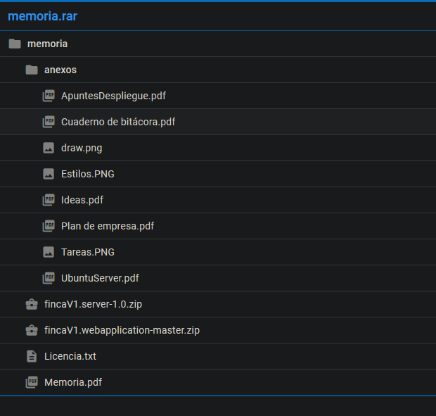

# Tecnologias

Angular 6/7/8
(Fui subiendo de version cada vez que salia una)

En la parte de backend use SpringBoot y mysql.

# Duracion

Desde junio del 2018 hasta marzo de 2019.

# Descripcion

Aplicacion web de gestion de facturas.
Esta aplicacion esta enfocado a los administradores de fincas.
Sirve para que los vecinos puedan acceder a las facturas que genera su comunidad.

Esta aplicacion tiene 2 tipos de usuario: administrador y vecino.

La parte de administrador permite gestionar facturas ya subidas a la plataforma y subir nuevas.
Las facturas son datos guardados en una base de datos no son PDFs ni IMGs.
Esto significa que la mayoria de la aplicacion gira en torno a formularios de angular.

Con el desarrollo de esta aplicacion aprendi a desplegar una aplicacion angular y java en un droplet de DigitalOcean.
Tambien aprendi a solucionar errores de compilacion que salieron a raiz de compilar los codigos fuente de java y angular.

# Extras

Esta aplicacion la hice como proyecto final de grado superior.
El proceso de aprendizaje de angular fue autodidacta y me base en este curso de [udemy](https://www.udemy.com/course/the-complete-guide-to-angular-2/).

 

Springboot tambien fue aprendizaje autodidacta ya que en el ciclo superior se enseña java _puro_

> Ahora mismo no recuerdo que curso segui, pero si recuerdo que era bastante malo ya que al final tenia que estar buscando casi todo en youtube

 

Estos son los apuntes que hice mientras desarrollaba la aplicacion.

> Es muy gracioso verlo ahora porque me doy cuenta de lo que he aprendido en solo estos 2 años

 

> Si alguien quiere ver los documentos hablarme por linkedin y os los paso sin problemas

# DISCLAIMER

Esta app no esta desplegada ni se recomienda el copia pega del codigo ya que son cosas mias que uso para probar nuevas tecnologias y no siguen patrones de diseño buenos ni optimos para el desarrollo real.
Lo uso para aprender yo
